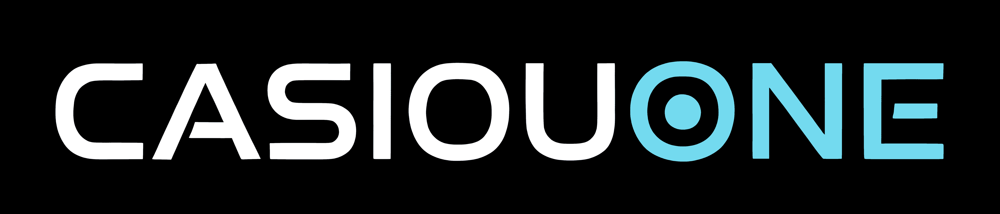

# Casiou One

Building cost-effective, practical software to help businesses operate efficiently and grow.

Casiou One designs and develops software platforms that balance clarity, usability, and scalability, making modern business tools accessible to organisations of all sizes.

## Products

Software products are built with a focus on cost-effectiveness, practicality, and long-term scalability for growing businesses.

---

### Bizplex

**Cost-effective business management software** designed to support growing organisations with practical tools and scalable foundations.

[Visit product site →](https://www.bizplex.com.au)

---

### Ingenii-Fin

**Cost-effective software for sanctions screening and AML/CTF compliance**, designed to help businesses meet regulatory obligations efficiently and reliably.

[Visit product site →](https://www.ingenii-fin.com.au)

---

## Learn More

- [Company Website](https://www.casiouone.com.au)  
- [LinkedIn](https://www.linkedin.com/company/casiouone)
